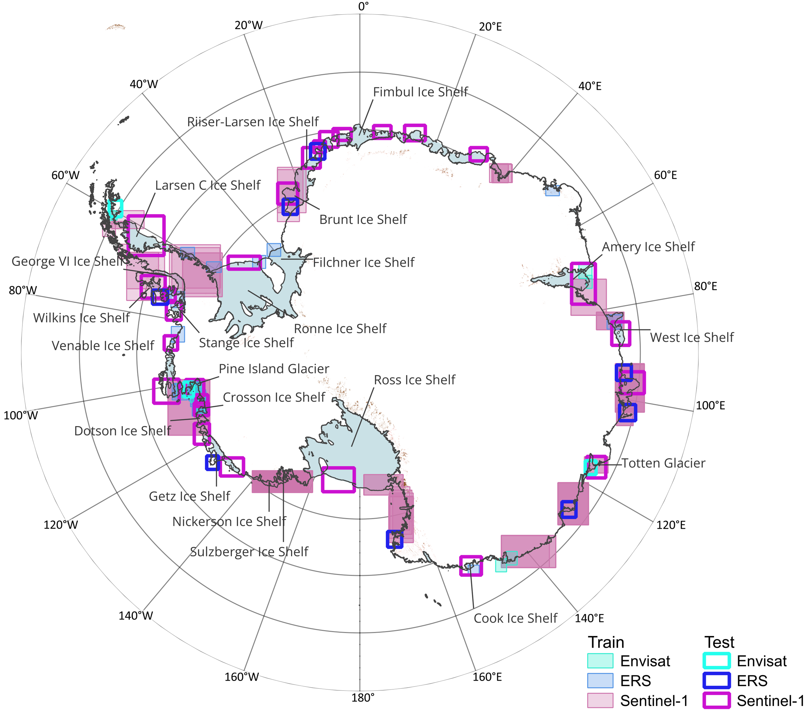

# Shelf-Bench dataset repository 🇦🇶

## Dataset Information
**Dataset provided by:** C. Baumhoer, DLR  
Download the Shelf-Bench dataset from: https://zenodo.org/records/17610871

Link to the original paper:

Our trained models are stored in the trained_models.zip
---
## 1. Create a virtual environment and install requirements.txt into your virtual environment

With python
```
python3 -m venv .venv
source .venv/bin/activate
```
Or with uv
```
uv venv
source .venv/bin/activate
```
```
pip install -r requirements.txt
```

## 2. Preprocess all images and masks

```
python data_preprocessing.py
```
or 
```
uv data_preprocessing.py
```

## 3. Apply trained_models to the Shelf-Bench dataset, or train from scratch using:

```
python ideal_train_file.py -m model.name=CHOOSE MODELS training.loss_function=CHOOSE LOSS FUNCTIONS
```
or 
```
uv run ideal_train_file.py -m model.name=CHOOSE MODELS training.loss_function=CHOOSE LOSS FUNCTIONS
```

This code uses Wandb which can be set up using: https://wandb.ai/site/

